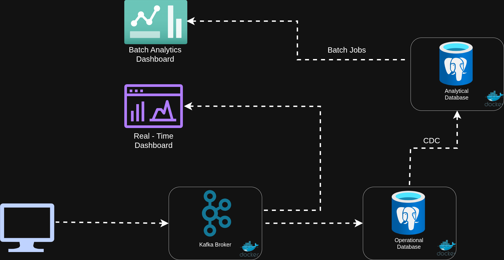

# Real-Time & Analytics Data Platform

A data engineering project that demonstrates a complete event-driven data pipeline, from order generation and Kafka ingestion to operational storage,
 analytics transformations, and real-time/historical dashboards.

The project uses Kafka for event streaming, PostgreSQL for operational and analytical storage, 
and FastAPI/WebSockets for exposing real-time metrics and analytics.

---

#Project Goals

The main goals of the project are to demonstrate:

- Event-driven data ingestion 
- Kafka producer/consumer architecture
- PostgreSQL operational data storage
- Change Data Capture (CDC)
- Analytical data modeling
- SQL-based transformations
- Real-time metrics
- Historical analytics
- REST APIs
- WebSocket communication
- Data validation and testing
- Separation between operational and analytical workloads

#Tech Stack

- **Python**: Application and data pipeline logic.
- **PostgreSQL **: Operational and Analytical storage.
- **Apache Kafka**: Event streaming.
- **FastAPI**: API and dashboard backend.
- **WebSockets**: Real-time dashboard updates.
- **SQL**: Data transformations and analytics.
- **Docker**: Infrastructure and service isolation.
- **Pytest**: Automated testing.
- **HTML/CSS/JavaScript**: Dashboard interfaces.

#Data Flow
##Order Generation

The project generates order activity and stores the required reference data such as:

- Customers
- Products
- Orders
- Order items

Orders are created first so that valid order_id values exist before order items are generated.

#Kafka Producer

The producer converts order-item information into JSON events and publishes them to Kafka.

The producer is responsible for:

1. Receiving generated order-item data
2. Creating an event
3. Serializing the event to JSON
4. Publishing it to the Kafka topic

Kafka acts as the event broker between the producer and downstream consumers.

#Kafka Consumer

The PostgreSQL consumer subscribes to the Kafka topic and processes incoming events.

The consumer:

1. Receives the Kafka message
2. Deserializes the JSON
3. Validates/processes the event
4. Converts it into the appropriate database representation
5. Stores the order item in PostgreSQL

The producer and consumer are independent processes, allowing Kafka to decouple event production from database ingestion.

#Operational Database

The operational PostgreSQL database stores the incoming order-item data.

This database is designed around the needs of the operational application rather than analytical querying.

The Kafka consumer writes incoming events into this database.

#Change Data Capture

Changes from the operational PostgreSQL database are replicated to a separate analytics PostgreSQL database using PostgreSQL's built-in Change Data Capture capabilities.

Kafka is intentionally not used for this part of the architecture.

This separates the operational workload from analytical workloads.

#Analytics Warehouse

The analytics database contains a warehouse schema with analytical tables.
The analytical schema is designed to make reporting and aggregation easier than querying the operational database directly.

Example analytical queries include:

- Total revenue
- Total orders
- Product performance
- Customer purchasing activity
- Order-item statistics

#Real-Time Dashboard

The real-time dashboard consumes metrics generated from incoming Kafka events.

The backend maintains recent event metrics and exposes them through a WebSocket connection.

The browser connects to:

/ws

and receives JSON metric updates.

The dashboard displays information such as:

- Total orders
- Total order items
- Total revenue
- Top products
- Top customers
- Recent order-item events

#Analytics Dashboard

The analytics dashboard is separate from the real-time dashboard.

It queries the analytical PostgreSQL database through FastAPI endpoints.

The dashboard is intended for historical and aggregated analysis rather than live event monitoring.

Examples include:

- Overall business metrics
- Top-performing products
- Customer activity
- Revenue statistics
- Aggregated order-item data

The dashboard queries the warehouse tables rather than the operational database.

#Running the Project 
1. Start infrastructure

Start Kafka and PostgreSQL using Docker Compose:

'''docker compose up -d'''

2. Start the Kafka producer

Run the producer application:

'''python3 -m src.kafka.producer'''

3. Start the PostgreSQL Consumer
Run the Kafka consumer.

'''python3 -m src.kafka.postgresql_consumer.postgresql_consumer'''

4. Start the dashboard

'''uvicorn src.kafka.dashboard.main:app --reload'''

